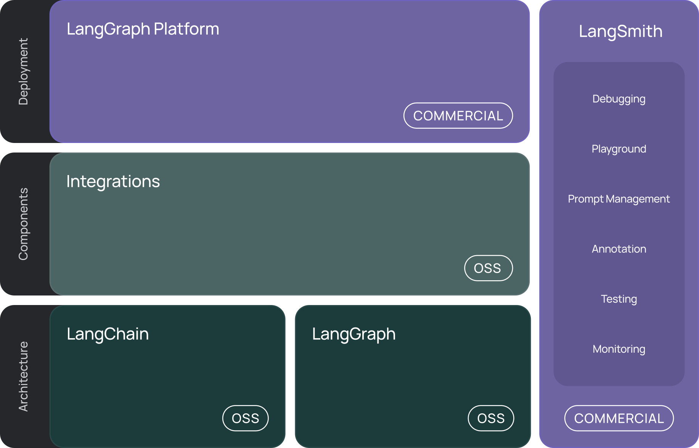

# ai-agent-talk-2024-11-30
## Links
Repo
```
git clone https://github.com/cvanvlack/ai-agent-talk-2024-11-30.git
```


Tutorial
- [Langchain Ecosystem](https://python.langchain.com/docs/introduction/)
- [Langchain - Build an Agent](https://python.langchain.com/docs/tutorials/agents/)
- [LangGraph Quick Start](https://github.com/langchain-ai/langgraph/blob/main/docs/docs/tutorials/introduction.ipynb)
- [LLM Agents Learning Path](https://maven.com/p/bafd83/llm-agents-learning-path)
- [Deep Learning AI - Agents in LangGraph](https://www.deeplearning.ai/short-courses/ai-agents-in-langgraph/)

References
- [Langchain - Chat models](https://python.langchain.com/docs/concepts/chat_models/)
- [Langchain - Tools](https://python.langchain.com/docs/concepts/tools/)
- [Langchain - Agents](https://python.langchain.com/docs/concepts/agents/)
- [Langgraph - Agent Architectures](https://langchain-ai.github.io/langgraph/concepts/agentic_concepts/)

Langchain Stack



## Steps to install
(Recommended) Install `pyenv`, it will automatically detect the correct Python version from the `.python-version` file. 

(Required) Create and activate a Python virtual environment:
```
python -m venv .venv

# Activate virtual environment
# On Unix/macOS:
source .venv/bin/activate

# On Windows:
.venv\Scripts\activate
```
Then install requirements
```
pip install -r requirements.txt
```
## Services to Setup for this
You will need an API Key from the following services for this tutorial
- [Open AI](https://platform.openai.com/settings/organization/api-keys) - This is for the LLM. I would recommend setting up a [project](https://platform.openai.com/settings/organization/projects) for this and then having an API key that's specific to the project.
- [Tavily](https://tavily.com/) - This is a search engine that is tailored for agents.
- [Langsmith](https://smith.langchain.com/) - This is for observation of your agent calls. Technically not required for this demo, but the Langchain docs put it in, likely as a marketing vehicle.

We are using the Open AI models for this, but you can choose [any particular model](https://python.langchain.com/docs/tutorials/agents/#using-language-models) from the example. Make sure you have an Open AI API key set in your .env file. There's an included [.env.example](.env.example) to see the format.
``` .env
# Set your openai api key like this
OPENAI_API_KEY=sk-...
TAVILY_API_KEY=...
LANGCHAIN_API_KEY=...
LANGCHAIN_TRACING_V2=true
LANGCHAIN_ENDPOINT="https://api.smith.langchain.com"
LANGCHAIN_PROJECT=...
```
