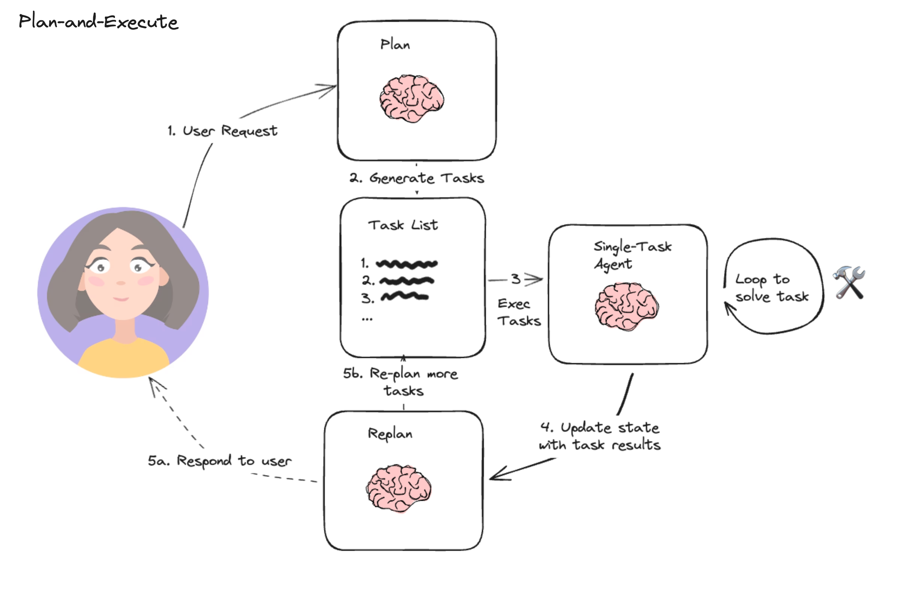

# Architectures
[https://github.com/langchain-ai/langgraph/tree/main/docs/docs/tutorials](https://github.com/langchain-ai/langgraph/tree/main/docs/docs/tutorials)

## Elements

[https://www.linkedin.com/pulse/chapter-1-ai-agents-agentic-behavior-ashish-bhatia-qkjre/](https://www.linkedin.com/pulse/chapter-1-ai-agents-agentic-behavior-ashish-bhatia-qkjre/)

## How "Agentic" is it?  
[https://langchain-ai.github.io/langgraph/concepts/high_level/](https://langchain-ai.github.io/langgraph/concepts/high_level/)

## Reflection

[https://github.com/langchain-ai/langgraph/blob/main/docs/docs/tutorials/reflection/reflection.ipynb](https://github.com/langchain-ai/langgraph/blob/main/docs/docs/tutorials/reflection/reflection.ipynb)

## Plan and Execute

[https://github.com/langchain-ai/langgraph/blob/main/docs/docs/tutorials/plan-and-execute/plan-and-execute.ipynb](https://github.com/langchain-ai/langgraph/blob/main/docs/docs/tutorials/plan-and-execute/plan-and-execute.ipynb)

## Researcher
[https://docs.tavily.com/docs/gpt-researcher/introduction](https://docs.tavily.com/docs/gpt-researcher/introduction)

## Agent Supervisor
[https://github.com/langchain-ai/langgraph/blob/main/docs/docs/tutorials/multi_agent/agent_supervisor.ipynb](https://github.com/langchain-ai/langgraph/blob/main/docs/docs/tutorials/multi_agent/agent_supervisor.ipynb)

## Multi Agent
[https://github.com/langchain-ai/langgraph/blob/main/docs/docs/tutorials/multi_agent/multi-agent-collaboration.ipynb](https://github.com/langchain-ai/langgraph/blob/main/docs/docs/tutorials/multi_agent/multi-agent-collaboration.ipynb)

## Hierarchical Agent Teams

[https://github.com/langchain-ai/langgraph/blob/main/docs/docs/tutorials/multi_agent/hierarchical_agent_teams.ipynb](https://github.com/langchain-ai/langgraph/blob/main/docs/docs/tutorials/multi_agent/hierarchical_agent_teams.ipynb)

## Language Agent Tree Search
[https://github.com/langchain-ai/langgraph/blob/main/docs/docs/tutorials/lats/lats.ipynb](https://github.com/langchain-ai/langgraph/blob/main/docs/docs/tutorials/lats/lats.ipynb)

